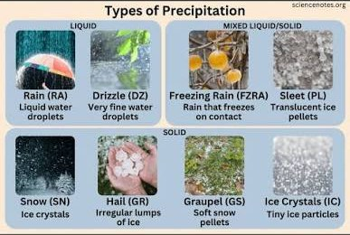

## The Problem

::: {.columns}
::: {.column width="65%"}
::: {.fragment}
::: {.bubble}
Hi! I am Ash, and I am studying the spatial and temporal distribution of **rainfall and drizzle** in Europe
:::
:::

::: {.fragment}
{width=55% fig-alt="Types of precipitation: rain, drizzle, freezing rain, sleet, snow, hail, graupel, ice crystals"}

*Types of precipitation: **rain, drizzle** (liquid), freezing rain, sleet (liquid/solid), snow, hail, graupel, ice crystals (solid)*
:::
:::
::: {.column width="35%"}
{fig-alt="Ash, a researcher" width=80% fig-align="center"}
:::
:::

## Approach

She needs to integrate multiple data from different sources

::: {.incremental}

- Climate models
- Satellite observations
- Urban sensor data
- Radar observations
- National meteorological datasets

:::

::: {.fragment .center-text}
Most probably each type of data comes in **different formats**, different ways of **access** and many of them use **different variable names** for the same physical quantity.
:::

::: {.fragment .center-text}
**How can these datasets be combined together to be able to answer Ash's scientific questions?**
:::

::: notes
She wants to compare climate model output with satellite observations, urban sensor measurements, radar or aircraft observations, national meteorological datasets, and datasets deposited in research repositories.

At first, the data ecosystem looks rich. She can search across platforms such as Copernicus Climate Data Store, NASA EarthData, the KNMI Data Platform, and 4TU.ResearchData. Many datasets are open, downloadable, and described online. Some platforms provide climate model output, others provide satellite products, national weather observations, radar composites, or research datasets deposited by individual research groups.
:::

## Notion of interoperability

::: {.fragment .center-text}

**Interoperability** is about enabling data to work with other data, software, services and research workflows as "easy" as possible.

:::

::: notes
"Easy" means with the fewest assumptions possible about how to integrate them, and also less manual intervention.
:::

## Interoperable datasets can connect to an ecosystem

::: {.eco}

::: {.pill .p-orange .center .fragment data-fragment-index="1"}
Interoperable dataset
:::

::: {.a .atop .fragment data-fragment-index="2"}
↑ it can be
:::

::: {.pill .p-grey .top .fragment data-fragment-index="2"}
Opened directly in a Python notebook
:::

::: {.a .aright .fragment data-fragment-index="3"}
it can be →
:::

::: {.pill .p-grey .right .fragment data-fragment-index="3"}
Visualized in an online viewer or dashboard
:::

::: {.a .abot .fragment data-fragment-index="4"}
it can be ↓
:::

::: {.pill .p-grey .bottom .fragment data-fragment-index="4"}
Accessed remotely through an API without downloading the file
:::

::: {.a .aleft .fragment data-fragment-index="5"}
← it can be
:::

::: {.pill .p-grey .left .fragment data-fragment-index="5"}
Combined with a second climate dataset
:::

:::
## Three layers of interoperability

::: {.layers}

::: {.layer .l-struct .fragment}
**Structural/Syntactic**  
*representation*

Can software understand how the data are organized?
:::

::: {.layer .l-sem .fragment}
**Semantic**  
*meaning*

Can another researcher or machine understand what the variables mean?
:::

::: {.layer .l-tech .fragment}
**Technical**  
*access*

Can software retrieve or exchange the data through standard mechanisms?
:::

:::

::: notes
Structural layer is also sometimes called syntactic layer.
:::

## Example: Ash wants to compare radar observations from 2009 and 2019 {.smaller}

::: {.columns}

::: {.column width="75%"}

::: {.incremental}

- **Structural**
  - Do the variables and dimensions match?

- **Technical**
  - Can both datasets be accessed programmatically?

- **Semantic**
  - Given a variable with the same name, would that imply they represent the same physical quantity?

:::

:::

::: {.column width="25%"}

{fig-alt="Ash, a researcher"}

:::

:::

## Exercise: True or False

::: {.incremental}

1. As long as data is open access, it is interoperable
2. Metadata standards help ensure interoperability
3. As long as the data is using an open standard format, it is interoperable.

:::

## What is coming in the workshop

::: {.columns}

::: {.column width="50%"}

- **Morning session**
  - Structural interoperability
  - Semantic interoperability

:::

::: {.column width="50%"}

- **Afternoon session**
  - Technical interoperability: data access protocols
  - Technical interoperability: API
  - Cloud-native layouts
  - Interoperable infrastructure in the AI era

:::

:::
